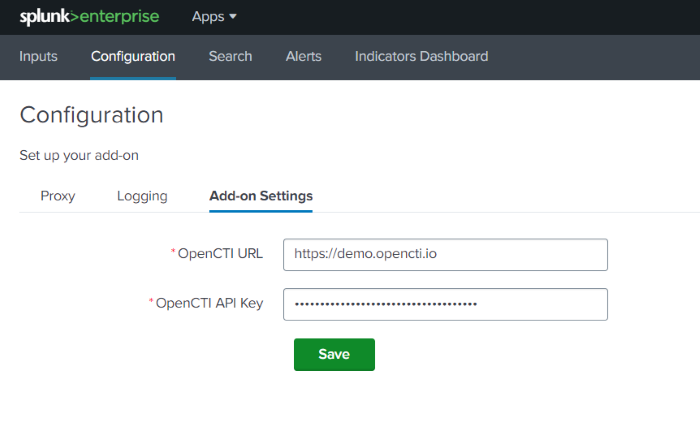

# OpenCTI Add On for Splunk

The OpenCTI Add-on for Splunk allows users to interconnect Splunk with OpenCTI platform.

## Key features

- Ability to ingest Indicators exposed through an OpenCTI live stream
- Ability to trigger OpenCTI actions in response of Alerts and to investigate them directly in OpenCTI

## Installation

### Installation from Splunkbase

1. Log in to the Splunk Web UI and navigate to "Apps" and click on "Find more Apps"
2. Search for "OpenCTI Add-on for Splunk"
3. Click Install
The app is installed

### Installing from file

1. Download latest version of the Splunk App: [TA-opencti-add-on-1.0.1.spl](https://github.com/OpenCTI-Platform/splunk-add-on/releases/download/1.0.1/TA-opencti-add-on-1.0.1.spl)
2. Log in to the Splunk Web UI and navigate to "Apps" and click on "Manage Apps"
3. Click "Install app from file"
4. Choose file and select the "TA-opencti-add-on-1.0.1.spl" file
5. Click on Upload
The app is installed

## General Configuration

### OpenCTI user account

Before configuring the App, we strongly recommend that you create a dedicated account in OpenCTI with the same properties as for a connector user account.
To create this account, please refer to [Connector users and Tokens](https://docs.opencti.io/latest/deployment/connectors/?h=connector+user#connector-users-and-tokens) documentation.

> [!WARNING]  
> As the application can generate many requests to OpenCTI without maintaining an HTTP session, it's strongly recommended to activate the “Use stateless mode” option on this user account.

Proceed as follows to enable the "stateless mode" option:
1. Update the previously created user and click on "Advanced options"
2. Enable the "Use stateless mode" options


### General Add-On settings

1. Navigate to Splunk Web UI home page, open the "OpenCTI add-on for Splunk" and navigate to "Configuration" page.
2. Click on "Add-on settings" tab and complete the form with the required settings:

| Parameter                  | Description                                                     |
|----------------------------|-----------------------------------------------------------------|
| `OpenCTI URL`              | The URL of the OpenCTI platform (A HTTPS connection is required |
| `OpenCTI API Key`          | The API Token of the previously created user                    |




If a proxy configuration is required to connect to OpenCTI platform, you can configure it on the Proxy page

| Parameter         | Description                                                                 |
|-------------------|-----------------------------------------------------------------------------|
| `Enable Proxy`    | Determines whether a proxy is required to communicate with OpenCTI platform |
| `Proxy Host`      | The proxy hostname or IP address                                            |
| `Proxy Port`      | The proxy port                                                              |
| `Proxy Username`  | An optional proxy username                                                  |
| `Proxy Password`  | An optional proxy password                                                  |


## OpenCTI Indicators Inputs Configuration

The “OpenCTI Add-On for Splunk” enables Splunk to be feed with indicators exposed through a live stream. To do this, the add-on implements and manages Splunk modular inputs. 
Indicators are stored in a dedicated kvstore named “opencti_iocs”. 
A default lookup definition named "opencti_lookup" is also implemented to facilitate indicator management.

Proceed as follows to enable the ingestion of indicators:

1. From the "OpenCTI add-on" sub menus, select the "Inputs" sub menu.
2. Click on "Create new input" button to define a new indicators input.
3. Complete the form with the following settings:

| Parameter       | Description                                                                                                    |
|-----------------|----------------------------------------------------------------------------------------------------------------|
| `Name`          | Unique name for the input being configured                                                                     |
| `Interval`      | Time interval of input in seconds. Leave as default (0) to allow continuous execution of the ingestion process |
| `Index`         | The index that the data will be stored in (default)                                                            |
| `Stream Id`     | The Live Stream ID of the OpenCTI stream to consume                                                            |
| `Import from`   | The number of days to go back for the initial data collection (default: 30) (optional)                         |

4. Once the Input parameters have been correctly configured click "Add".


5. Validate the newly created Input and ensure it's set to enabled.

As soon as the input is created, the ingestion of indicators begins.
You can monitor the import of these indicators using the following Splunk query that list all indicators ingested in the kvstore: 

```
| inputlookup opencti_lookup
```

You can also consult the "Indicators Dashboard" which gives an overview of the data ingested.


The ingestion process can also be monitored by consulting the log file ```ta_opencti_add_on_opencti_indicators.log``` present in the directory ```$SPLUNK_HOME/var/log/splunk/```


## OpenCTI custom alert actions

You can use the "OpenCTI Add-on for Splunk" to create custom alert actions that automatically create incidents or incidents response case in response to alert trigger by Splunk.

### Create an incident or an incident response case in OpenCTI

You can create an incident or an incident response case in OpenCTI from a custom alert action.
1. Write a Splunk search query.
2. Click Save As > Alert.
3. Fill out the Splunk Alert form. Give your alert a unique name and indicate whether the alert is a real-time alert or a scheduled alert.
4. Under Trigger Actions, click Add Actions.
5. From the list, select "OpenCTI - Create Incident" if you want the alert to create an incident in OpenCTI or "OpenCTI - Create Incident Response" if you want to create an incident response case in OpenCTI.


6. Complete the form with the following settings:

| Parameter                | Description                                           | Scope                             |
|--------------------------|-------------------------------------------------------|-----------------------------------|
| `Name`                   | Name of the incident or incident response case        | Incident & Incident response case |
| `Description`            | Description of the incident or incident response case | Incident & Incident response case |                              
| `Type`                   | Incident Type or incident response case type          | Incident & Incident response case |                              
| `Severity`               | Severity of the incident or incident response case    | Incident & Incident response case | 
| `Priority`               | Priority of the incident response case                | Incident response case            | 
| `Labels`                 | Labels (separated by a comma) to be applied           | Incident & Incident response case | 
| `TLP`                    | Markings to be applied                                | Incident & Incident response case | 
| `Observables extraction` | Method for extracting observables                     | Incident & Incident response case | 


You can also use [Splunk "tokens"](https://docs.splunk.com/Documentation/Splunk/9.2.2/Alert/EmailNotificationTokens#Result_tokens) as variables in the form to contextualize the data imported into OpenCTI.
Tokens represent data that a search generates. They work as placeholders or variables for data values that populate when the search completes.

Example of a configuration to create an incident in OpenCTI


### Observables extraction

To extract and model alert fields as OpenCTI observables attached to the incident or incident response case, the Add-on purpose two methods describe below.

#### CIM model

The “CIM model” method is based on the definition of CIM model fields. With this method, the Add-on will extract all the following fields and model them as follows:

| CIM Field         | Observable type                     |
|-------------------|-------------------------------------|
| `url`             | URL observable                      | 
| `url_domain`      | Domain observable                   |                       
| `user`            | User account observable             |                            
| `user_name`       | User account observable             | 
| `user_agent`      | User agent Observable               |
| `http_user_agent` | User agent Observable               |
| `dest`            | IPv4 or IPv6 or Hostname observable |
| `dest_ip`         | IPv4 or IPv6 observable             |
| `src`             | IPv4 or IPv6 or Hostname observable |
| `src_ip`          | IPv4 or IPv6 observable             |
| `file_hash`       | File observable                     |
| `file_name`       | File observable                     |


#### Field mapping

The “Field mapping” method searches for event fields starting with the string “octi_” and ending with an observable type.
The following list describe list of supported fields:

| OCTI Field                         | Observable type                       |
|------------------------------------|---------------------------------------|
| `octi_ip`                          | IPv4 or IPv6 observable               | 
| `octi_url`                         | URL observable                        |
| `octi_domain`                      | Domain observable                     |                       
| `octi_hash`                        | File observable                       |                       
| `octi_email_addr`                  | Email address observable              |                       
| `octi_user_agent`                  | User agent observable                 |                       
| `octi_mutex`                       | Mutex observable                      |                       
| `octi_text`                        | Text observable                       |                       
| `octi_windows_registry_key`        | Windows Registry Key observable       |                       
| `octi_windows_registry_value_type` | Windows Registry Key Value observable |                       
| `octi_directory`                   | Directory observable                  |                       
| `octi_email_message`               | Email message observable              |    
| `octi_file_name`                   | File observable                       |    
| `octi_mac_addr`                    | MAC address observable                | 
| `octi_user_account`                | User account address observable       |    

You can use the Splunk ```eval``` command to create a new field based on the value of another field.

Example:

```sourcetype=* | lookup opencti_lookup value as url_domain OUTPUT id as match_ioc_id | search match_ioc_id=* | eval octi_domain=url_domain | eval octi_url=url ```


Logs related to OpenCTI customer alerts are available in the following two log file:

```$SPLUNK_HOME/var/log/splunk/opencti_create_incident_modalert.log```

```$SPLUNK_HOME/var/log/splunk/opencti_create_incident_response_modalert.log```


